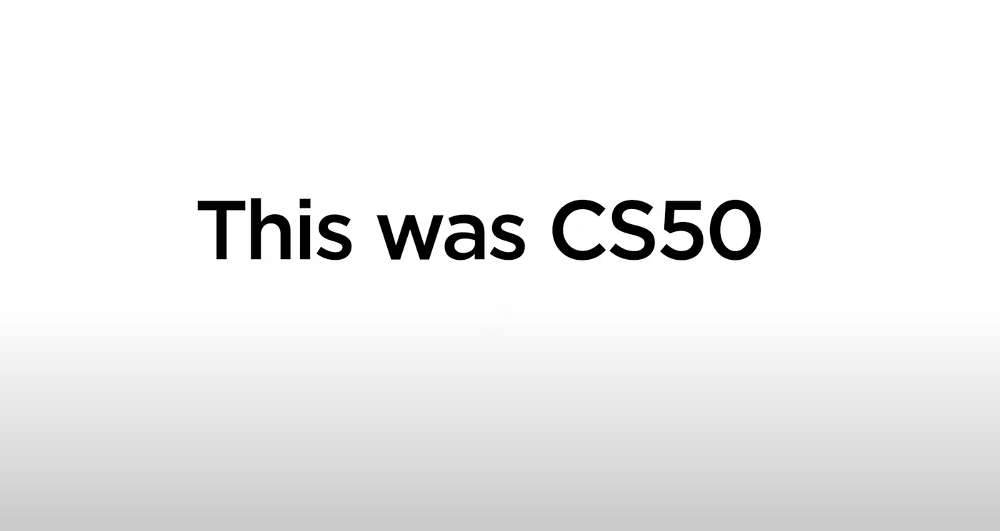

# Reddit Sentiment Analysis

#### Video Demo: [https://youtu.be/krkymMKdeis](https://youtu.be/krkymMKdeis)

---

## Project Overview

**Reddit Sentiment Analysis** is a full-stack web application designed to analyze the sentiment of posts from any public subreddit. This project allows users to fetch posts from Reddit, categorize them as positive, neutral, or negative, and visualize these trends using interactive charts and word clouds.

The application is built using:
* **Python (Flask)** for the backend
* **JavaScript** for frontend interactivity
* **HTML/CSS** for frontend design

Visualization is expertly handled using **Chart.js** for interactive charts and **WordCloud.js** for dynamic word clouds.

This project demonstrates how data from social media platforms can be processed and analyzed to gain valuable insights into public opinion and emerging trends. Users can easily explore a chosen subreddit, highlight specific keywords, and observe community sentiment in a visual and highly interactive way.

---

## Screenshots
    

## Motivation

Reddit stands as one of the largest online communities globally, where millions of users engage in sharing opinions, news, and discussions daily. Understanding the underlying sentiment within posts on a subreddit can be incredibly beneficial for various stakeholders:
* **Users** can gauge the general mood of a community.
* **Researchers** can identify trending topics and public sentiment shifts.
* **Marketers** can make data-driven decisions based on community reception.

The primary motivation behind developing this project was to seamlessly combine key areas of modern software development: **web development**, **data analysis**, and **data visualization**. My aim was to create a practical application that is both educational in its approach and highly functional in its utility.

---

## Features

This application provides a robust set of features to facilitate comprehensive sentiment analysis:

### 1. Subreddit Post Analysis
* Users can easily input the name of the public subreddit they wish to analyze.
* The application fetches a user-defined number of posts, ranging from 10 to 50, directly using Reddit's API.
* An **optional keyword** can be provided, enabling the application to highlight specific words within the fetched posts for focused analysis.

### 2. Sentiment Classification
* Each fetched post undergoes a thorough analysis and is categorized as either **Positive**, **Neutral**, or **Negative** based on its textual content.
* Detailed sentiment scores, including raw counts and percentages, are clearly displayed both numerically and visually.

### 3. Data Visualization
* **Bar Chart**: An interactive bar chart, powered by **Chart.js**, visually presents the distribution of sentiments, with explicit percentages displayed next to each bar for clarity.
* **Word Cloud**: A dynamic word cloud, generated by **WordCloud.js**, highlights the most frequently used words across the fetched posts. Larger words in the cloud indicate higher frequency.
* Both the sentiment chart and the word cloud can be **downloaded as PNG images** for convenient offline use or sharing.

### 4. Interactive Post Listings
* The top positive and negative posts are displayed in user-friendly, expandable lists, allowing for quick review of the content driving the sentiment.
* User-provided keywords are automatically **highlighted** within these post listings, making it easier to locate relevant discussions.

### 5. User Experience Enhancements
* A **Dark Mode Toggle** is integrated for improved accessibility and enhanced comfort during night-time usage.
* The design is fully **responsive**, ensuring seamless compatibility and optimal viewing across a wide range of devices, including desktops, tablets, and mobile phones.
* A clear **loading spinner** is displayed during data fetching and processing, providing essential user feedback and indicating ongoing operations.

---

## Technologies Used

### Frontend
* HTML5, CSS3, JavaScript (ES6)
* **Chart.js**: For generating interactive bar charts.
* **Chart.js Datalabels plugin**: To display percentages directly on the chart bars.
* **WordCloud.js**: For dynamic word cloud generation.
* Custom CSS for sophisticated styling and responsive design implementation.

### Backend
* Python 3.13
* **Flask** web framework: For handling routing, requests, and serving the application.
* **PRAW** (Python Reddit API Wrapper): Utilized for efficient fetching of posts from the Reddit API.
* **JSON**: The standard format for data communication between the frontend and backend.

### Deployment
* Developed and rigorously tested within **CS50 Codespaces**.
* The application runs on the Flask development server.
* Designed to be compatible with popular cloud platforms such as Heroku, Render, or Vercel for potential future deployment.

---

## How It Works

The application follows a straightforward flow to deliver sentiment insights:

1.  **User Input**:
    * The user initiates the process by entering a subreddit name, an optional keyword, and specifying the number of posts to analyze.
2.  **Data Fetching**:
    * The backend, powered by the Flask framework, uses the `PRAW` library to asynchronously fetch the most recent posts from the specified subreddit.
3.  **Sentiment Analysis**:
    * Each fetched post is individually analyzed and categorized as positive, neutral, or negative.
    * The system then calculates the total sentiment counts and corresponding percentages for each category.
4.  **Data Visualization**:
    * The processed data is sent to the frontend. There, `Chart.js` renders a dynamic bar chart displaying the sentiment distribution with numeric percentages.
    * Concurrently, `WordCloud.js` generates a word cloud that visually represents the most frequent words in the aggregated posts.
5.  **Top Posts Display**:
    * The most positive and most negative posts are listed in expandable sections, offering quick access to their content.
    * Any user-entered keywords are highlighted within these posts for easy reference.
6.  **Download Functionality**:
    * Users are provided with dedicated buttons to download both the sentiment chart and the word cloud as PNG files, enabling offline use.

---

## File Structure

The project's file structure is organized for clarity and maintainability:

```

project/
│
├── app.py                     \# Main Flask application logic
├── services/                  \# Directory for service modules
│   └── reddit\_service.py      \# Contains logic for Reddit API interactions (PRAW)
├── static/                    \# Directory for static frontend assets
│   ├── styles.css             \# Custom CSS for styling, including dark mode
│   └── script.js              \# JavaScript for charts, word cloud generation, and interactivity
├── templates/                 \# Directory for HTML templates
│   └── index.html             \# The main HTML template for the application
├── requirements.txt           \# Lists all Python dependencies
└── README.md                  \# This project documentation file

````

---

## Installation & Setup

To get a local copy of this project up and running, follow these simple steps:

### 1. Clone the repository

```bash
git clone <your-repo-url>
cd project
````

### 2\. Install dependencies

Ensure you have Python 3.13 installed. Then, install the necessary Python packages:

```bash
pip install -r requirements.txt
```

### 3\. Run the application

Once dependencies are installed, you can start the Flask development server:

```bash
flask run
```

-----

## Usage Instructions

1.  **Open the web application** in your browser (usually at `http://127.0.0.1:5000/`).
2.  **Enter a subreddit name** (e.g., `India`) into the designated input field.
3.  **Optionally, add a keyword** to refine your analysis (e.g., `cricket`).
4.  **Select the number of posts** you wish to analyze (default is 20, maximum is 50).
5.  Click the **"Analyze"** button to initiate the sentiment analysis.

### View the Results:

  * A clear **Sentiment Summary Bar Chart** with percentages.
  * A dynamic **Word Cloud** highlighting the most frequent words.
  * **Top Positive and Negative Posts** displayed in expandable sections.
  * You can **Toggle dark mode** for a different visual experience.
  * Use the provided buttons to **Download charts and word cloud** as PNG files.

-----

## Future Improvements

This project lays a strong foundation for further enhancements:

  * **Support time-series sentiment analysis** to track trends and shifts in sentiment over time.
  * **Include comment analysis** for a more granular and deeper insight into community discussions.
  * **Allow multi-subreddit comparison** to analyze and contrast sentiment across different communities on similar topics.
  * **Add user login and history** functionalities for personalized analytics and saved reports.
  * **Implement async data fetching** to significantly improve application performance and responsiveness, especially for larger requests.

-----

## Author

**Shashank Padmasali**

  * GitHub: [shashank3115](https://www.google.com/search?q=https://github.com/shashank3115)
  * edX: Shashank Padmasali
  * Hyderabad, India
  * Date: 2025-09-25


